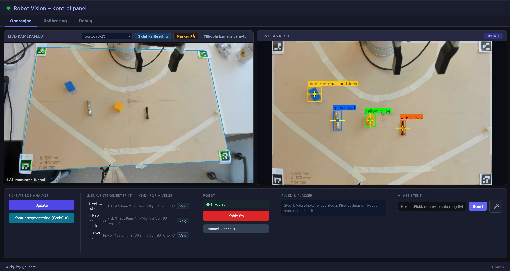
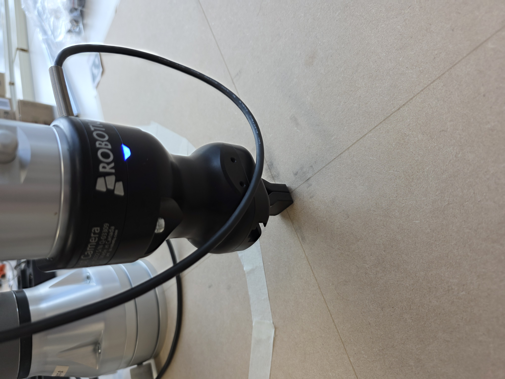
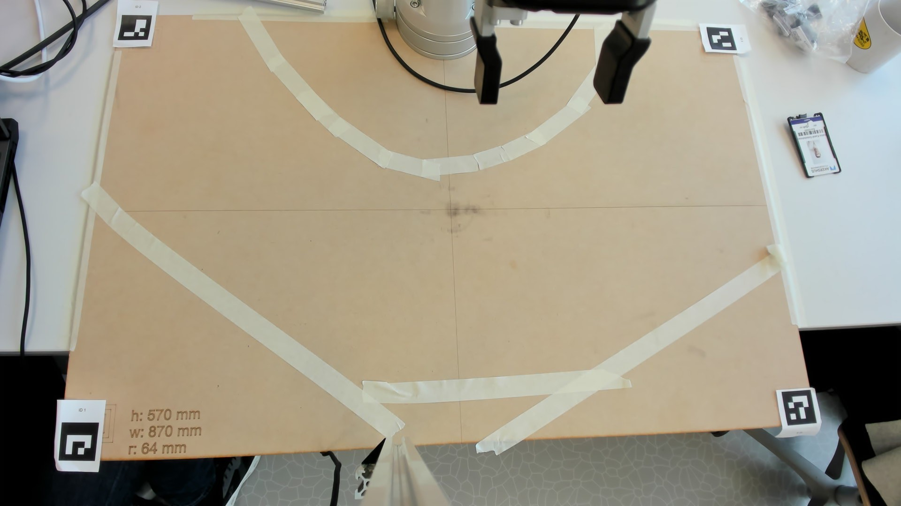

# Universal Robots Vision Pick-and-Place

This project controls a Universal Robots UR3 arm with a Robotiq gripper from a browser-based vision interface. A fixed overhead camera sees the full work area, ArUco markers calibrate camera pixels to robot coordinates, and Gemini vision detects objects and suggests grasp points for pick-and-place.

The web app has two main image views: the left image is the live camera feed, and the right image is the latest analyzed image with object annotations.



## How It Works

The system uses four coordinate steps:

1. The overhead camera captures the work area and the four ArUco markers.
2. ArUco calibration creates a homography and a corrected top-down view.
3. Gemini analyzes that top-down image and returns object boxes, grasp points, and object angle.
4. The server converts the selected image point into robot XY coordinates, applies workspace tilt correction, and sends the motion to the UR3.

The long yellow line drawn on an object in the analyzed image indicates the planned gripper placement/orientation for picking.

The robot wrist camera can be used as a secondary perspective for analysis, but the overhead camera remains the primary calibrated view because it sees the full workspace and markers.

## Hardware Setup

### Robot Zero Pose

Before using the system, set the robot zero pose. This defines the center of the work area and the reference frame used by all relative robot moves.

Move the robot to the position shown below. The end effector should be level when capturing the zero pose.



Then run:

```powershell
.\.venv\Scripts\python.exe robot\set_robot_zero.py
```

The captured pose is stored in `config.json` under:

```json
"robot": {
  "zero_pose": [...]
}
```

Repeat this step if the robot, table, camera, or work surface position changes.

### Camera Placement

The overhead camera must have a clear view of the full work area and all four ArUco markers. This is required for workspace segmentation, calibration, and creating the top-down view.



### ArUco Markers

The current setup expects four `DICT_4X4_50` markers with IDs `1` to `4`. Their marker centers are configured in `config.json`:

```json
"aruco": {
  "marker_size_m": 0.04,
  "markers": {
    "1": [-0.415, -0.265],
    "2": [-0.415,  0.265],
    "3": [ 0.415,  0.265],
    "4": [ 0.415, -0.265]
  }
}
```

The labels are 40 mm by 40 mm, so the outer workspace bounds are 20 mm beyond the marker centers.

### Table Tilt Correction

If the table is not level, correct it in `config.json`:

```json
"workspace_rotation": {
  "x_deg": 0.0,
  "y_deg": -0.535,
  "z_deg": 0.0
}
```

This correction is applied when converting workspace moves to robot coordinates.

## Software Setup

1. Create and activate a Python environment.

```powershell
python -m venv .venv
.\.venv\Scripts\activate
```

2. Install dependencies.

```powershell
pip install -r requirements.txt
```

3. Configure environment variables.

Create `.env` in the project root for Gemini:

```env
GEMINI_API_KEY=your_api_key_here
```

Create or edit `robot/.env` for the robot:

```env
ROBOT_IP=192.168.0.25
ROBOT_AUTO_CONNECT=false
```

Keeping `ROBOT_AUTO_CONNECT=false` lets the web server start even if the robot is offline.

## Running The System

Start the Flask server:

```powershell
.\.venv\Scripts\python.exe web\server.py
```

Open a browser:

```text
http://localhost:5000
```

Then:

1. Open the `Kalibrering` tab.
2. Confirm all ArUco markers are visible.
3. Click `Kalibrer nå`.
4. Go to the `Operasjon` tab.
5. Click `Koble til robot`.
6. Click `Update` to analyze the work area.

## Web Interface Operation


### Live View

The left image is the live feed. It can show the overhead camera or the wrist camera, but analysis always uses the overhead camera.

### Analyzed Image

The right image is the latest analyzed frame. Click `Update` to run object detection again. Click `GrabCut` to use contour-style segmentation.

Detected objects appear with:

- bounding box or contour
- pickup point
- gripper orientation line
- robot X/Y coordinates when calibrated

### Pick And Place

1. Click an object in the analyzed image to select it.
2. Click a destination point in the same analyzed image.
3. The robot starts the pick-and-place sequence automatically.

The object angle and the long gripper line are used to rotate the gripper before picking.

### AI Assistant

You can type a command in the AI assistant text box, for example:

```text
Pick the red object and place it on the right side.
```

You can also use the microphone button to start and stop a voice recording of a command.

### Manual Controls

Manual controls can:

- connect or disconnect the robot
- move to a typed XYZ/RX/RY/RZ pose
- return the robot to home position
- open or close the gripper
- stop the robot

Use manual moves carefully. Coordinates are relative to the zero pose.

## Calibration Verification

In the `Kalibrering` tab:

1. Click `Aktiver klikk-verifisering`.
2. Click a known point in the camera image.
3. Check the displayed X/Y coordinate.
4. Optionally move the robot to that point to verify the calibration physically.

If X/Y movement is mirrored, check the top-down orientation and the coordinate conversion settings in `web/server.py` and `tools/robot_tools.py`.

## Configuration

All project calibration and runtime geometry settings are in root `config.json`.

Important sections:

- `aruco`: marker dictionary, marker size, and marker center coordinates
- `homography`: saved calibration matrix and top-down bounds
- `workspace_rotation`: table/workspace tilt correction
- `robot.zero_pose`: robot reference pose

Secrets and machine-specific values stay in `.env` and `robot/.env`.

## Important Files

```text
web/server.py              Flask server and API endpoints
web/templates/index.html   Browser UI
config.json                Calibration and geometry config
config.py                  Shared config loader/saver
robot/set_robot_zero.py    Captures robot zero pose
robot/ur3_controller.py    UR3 and Robotiq control
tools/robot_tools.py       Pick/place and robot action helpers
vision/camera.py           Overhead and wrist camera capture
vision/aruco_calibrator.py ArUco marker detection
vision/homography.py       Camera-to-robot coordinate mapping
vision/annotation.py       Detection drawing and GrabCut segmentation
ai/detection.py            Gemini object detection
ai/gemini_agent.py         Natural-language robot command planning
```

## Troubleshooting

- Server starts but robot is offline: this is expected when `ROBOT_AUTO_CONNECT=false`; connect from the web UI.
- Robot moves to wrong location: verify zero pose, ArUco calibration, and workspace rotation.
- Calibration view is wrong: make sure all four markers are visible and marker IDs/positions match `config.json`.
- Picks are high/low at one side of the table: adjust `workspace_rotation`.
- Segmentation looks wrong: click `Update` again, confirm the top-down image is correct, and check server logs for `GrabCut-masker`.
- After robot collision/protective stop: clear the stop on the robot, disconnect in the UI if needed, then press `Koble til robot` again.
